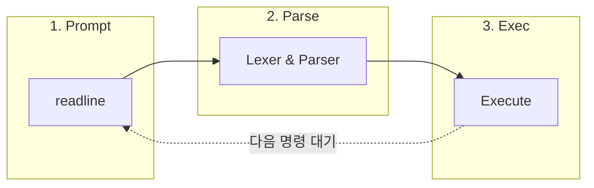

# Requirements

## 0. Process



## 1. Prompt

### 1.0. Requirements

Prompt 문자열
- 프롬프트 문자열은 `minishell> ` 이어야 한다.

입력 함수
- 입력은 `readline` 기반으로 받는다.

빈 입력
- 빈 입력(`""`)은 무시하고 다시 프롬프트를 표시한다.

히스토리
- 정상 입력은 히스토리에 추가한다.

`SIGINT` 입력
- `SIGINT` (`Ctrl+C`) 수신 시 현재 입력 줄을 버리고 새 줄에서 프롬프트를 다시 표시한다.

`SIGQUIT` 입력
- 프롬프트 대기 상태에서 `SIGQUIT` 는 무시한다.

EOF 입력
- EOF (`Ctrl+D`) 입력 시 세션을 정상 종료 경로로 보낸다(현재 구현은 `panic(FATAL_EXIT)` 경유).


---


## 2. Parse

### 2.0. Requirements

Heredoc delimeter는 환경변수 확장하지 않는다.
- `cat << $MYEOF` 인 경우 delimeter는 `$MYEOF`.

공백이 포함된 환경변수는 각각 별개의 WORD 취급한다.
```
$ HO_HELLO="ho hello"; ec$HO_HELLO
hello
```
- 순서: parse_expand < parse_tokenize

Process
- parse_is_quote_ok
- parse_tokenize
- parse_expand (ignore heredoc delimter)
- parse_tokenize
- parse_quote
- parse_cmd


## 3. Exec

### 3.0. Requirements

Process
- exec_heredoc
- exec_run

exec_heredoc 요구사항
- 포크 후 readline
- 임시파일은 fd 남기고 unlink.

exec_heredoc 시그널
```
부모 시그널:
	SIGINT: SIG_IGN

자식 시그널:
	SIGINT: SIG_DFL
```

exec_run 순서
- sigaction
- pipe
- fork
- sigaction
- redirection 처리
- execve

exec_run 요구사항
- Single built-in: fork 없음.

exec_run 시그널
```
부모 시그널:
	SIGINT: SIG_IGN

자식 시그널:
	SIGINT: SIG_DFL
```
